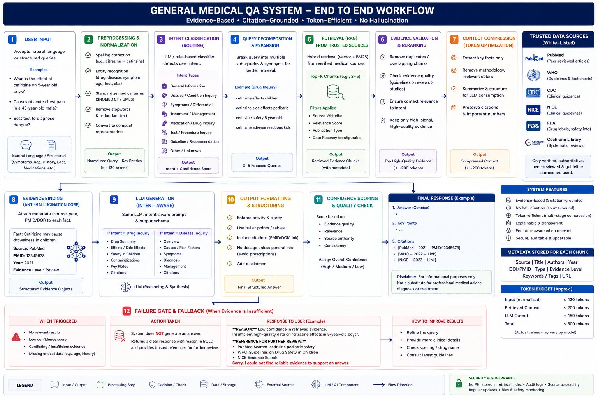

<div align="center">


# 🩺 MedBuddy
### General Medical QA System — Evidence-Based · Citation-Grounded · No Hallucination

*A clinical decision support assistant that retrieves, validates, and synthesises evidence from trusted medical sources before generating any response.*

</div>

---

## How It Works



The system runs every query through a **12-step pipeline** — from natural language input to a citation-backed answer — with a hard failure gate that returns nothing rather than hallucinate.

---

## Key Features

| Feature | Detail |
|---|---|
| **Zero hallucination** | LLM may only use facts present in the retrieved evidence table |
| **Citation-grounded** | Every claim is tagged with PMID / DOI / source link |
| **Intent-aware generation** | Drug inquiry, disease inquiry, guideline lookup — each gets a tailored prompt |
| **Token-efficient** | Hard budget: Input ≤120 · Context ≤200 · Output ≤150 · Total ≤500 tokens |
| **Hard failure gate** | Returns a clear "no answer" with references rather than a low-confidence guess |
| **Pediatric-aware** | Age-sensitive safety checks applied automatically |

---

## Pipeline Overview

```
User Query → Preprocessing → Intent Classification → Query Decomposition
    → RAG Retrieval (PubMed · WHO · CDC · NICE · FDA · Cochrane)
        → Evidence Validation → Context Compression → Evidence Binding
            → LLM Generation → Output Formatting → Confidence Check
                → ✅ Final Answer with Citations  |  ❌ Failure Gate
```

---

## Trusted Sources

- **PubMed** — Peer-reviewed biomedical literature
- **WHO** — Guidelines and fact sheets
- **CDC** — Clinical guidance
- **NICE / NHS** — Evidence-based clinical guidelines
- **FDA** — Drug labels and safety information
- **Cochrane Library** — Systematic reviews

---

## Quickstart

```bash
# 1. Clone
git clone https://github.com/thesilentinvader042/MedBuddy
cd MedBuddy

# 2. Configure
cp .env.example .env
# Add GROQ_API_KEY and PUBMED_API_KEY to .env (no quotes on macOS)

# 3. Install
cd backend && pip install -r requirements.txt

# 4. Run
uvicorn main:app --reload --port 8000

# 5. Open
open frontend/index.html
```

---

## Environment Variables

```env
GROQ_API_KEY=your_key_here
PUBMED_API_KEY=your_key_here
PUBMED_EMAIL=your@email.com
```

> ⚠️ Never commit `.env` to version control.

---

## Disclaimer

> MedBuddy is for **informational and clinical decision support purposes only**.  
> It is not a substitute for professional medical advice, diagnosis, or treatment.  
> Always verify output with clinical judgment and appropriate investigations.

---

<div align="center">
  <sub>Built with Llama 3.3 70B · FastAPI · PubMed E-utilities · Evidence-first by design</sub>
</div>
